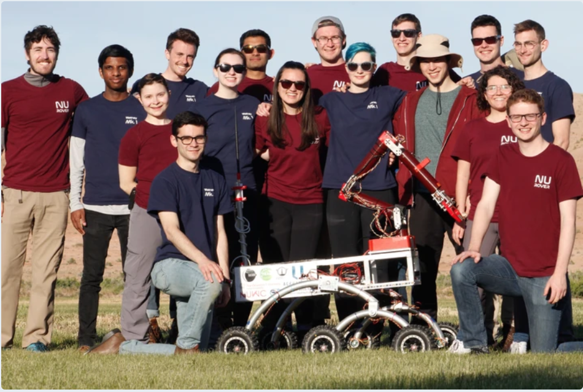

# Rover 2019

## Background

This package houses code for Northeastern University Mars Rover Team for the 2019 [Mars Society University Rover Challenge](http://urc.marssociety.org/). This folder has been tailored to respect IP of Northeastern University Mars Rover Team. Only packages written by me are included here, more information regarding this project available upon request.

## Problem Statement

The University Rover Challenge challenges students to design, build, and test a Rover capable of completing a set of tasks in a Mars-esque environment (namely the [Mars Desert Research Station](https://mdrs.marssociety.org/) in Hanksville, UT), including:
1. **Extreme Retrieval** - Retrieve and deliver items from point to point
2. **Equipment Servicing** - Manipulate an instrumentation panel (flip switches, push buttons, open doors, etc.)
3. **Life Detection** - Sample the environment and run onboard tests to confirm/deny existence of life
4. **Autonomous Traversal** - Autonomously navigate a course, avoiding obstacles and move towards a discernible goal (tennis ball, AR tag, etc.)

## [Northeastern University Mars Rover Team](https://www.northeasternrover.com/)

Our 2019 Rover, Watney Mk. 1 (pictured below), was our response to this challenge. Featuring a rocker bogey suspension system, 5-DOF robotic arm, attachable life detection payload, and all custom boards, we were selected to be one of 36 teams to be selected to compete from the original 84 applicant pool. Furthermore, we were the _only_ first time applicant to be accepted.

### Electrical/Software System Design
Watney Mk. 1 featured entirely custom parts; a custom chassis, suspension and arm were fabricated, with custom electronics and custom code driving it all. The Rover was divided into three main subsystems:
1. **Drive** - The hardware/software used to take user controller and current sense input and drive the DC motors powering the 6 wheels on the rover.
2. **Arm** - The hardware/software used to take user controller input and drive the DC motors on the 5-DOF robotic arm.
3. **Life Detection** - The hardware/software used to take user controller input and drive an array of solenoids, motors, pumps, and cameras in order to inject a soil slurry into our system, and view the results of several scientific assays.

#### Board Architecture
Each board featured multiple ATmega328P microcontrollers on board. The number of micros on each board differed depending on the board's function, but every board had one _Master_ ATMega that leveraged UART communication to send and receive data to/from ROScore. The Master ATMega and all other Slave ATMega micros were connected via I2C.

Each one of these subsystems was dedicated its own ATmega328P-based board, and in order to bring all of these subsystems together, we leveraged the ROS framework to handle all information distribution. An NVIDIA Jetson TX2 hosted ROScore.

#### Software Architecture
Rosserial_Arduino was used to seamlessly integrate our custom boards into the ROS environment. Given our tight development schedule, we used the Arduino software library for rapid firmware prototyping. In addition to the firmware packages, an additional safety circuit (or watchdog **ADD LINK HERE**) was created, autonomously ensuring that the rover was not allowed to put itself into dangerous situations.
